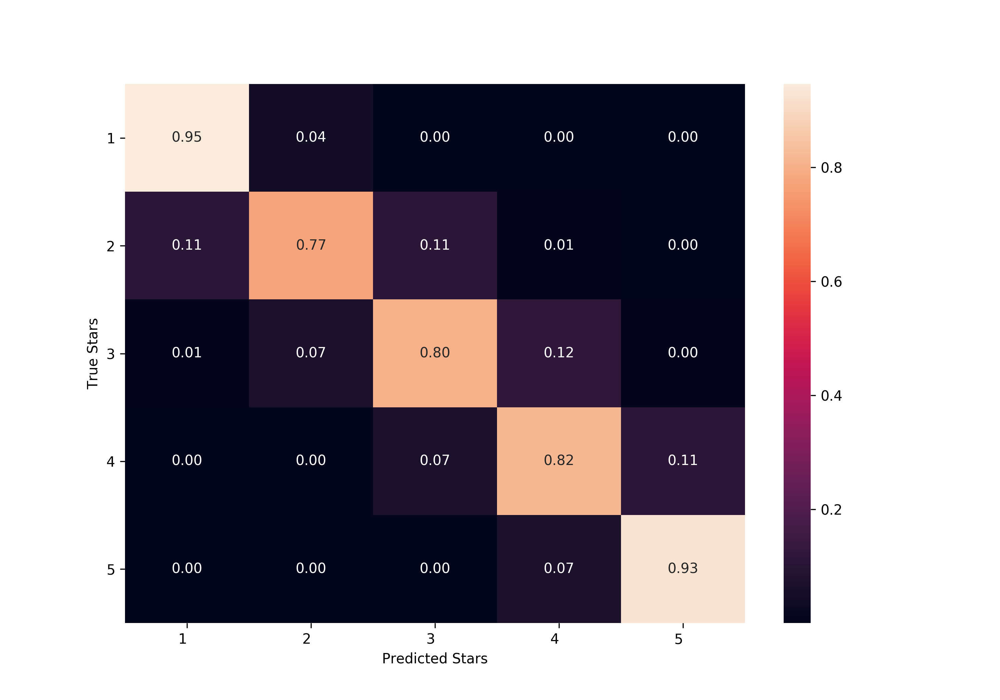

# A Structured Self-Attentive Sentence Embedding
Re-Implementation of [_A Structured Self-Attentive Sentence Embedding_](https://arxiv.org/pdf/1703.03130.pdf) by Lin et al., 2017.

## Results

| Set        | Loss     | Accuracy |
|:-----------|---------:|---------:|
| Training   | 1.136    | 77.26%   |
| Validation | 1.587    | 60.91%   |

Above results were obtained after training for 5 epochs. The training set contained 20000 examples and validation set 1000 examples. The model with the best validation loss was choosen. Note that the training set size in the paper is much bigger.

## Data
The Yelp dataset can be download [here](http://pan.webis.de/clef16/pan16-web/author-profiling.html). 
After downloading, the file only has to be unzipped.

## Training
You can run the training procedure with the default settings with the following command:  
`python3 train.py --data-dir <dir of unzipped yelp data>`

For more information about training settings run:  
`python3 train.py --help`

## Analysis & Visualization
Once the model is trained, the attention pattern can be visualized as done in the paper.
The following python script will create an HTML file with the reviews and respective attention pattern. 
Also the confusion matrix for the classification will be created.  
`python3 viz.py --html --cm --data-dir <dir of unzipped yelp data> --validation-set <path to saved validation split>`

### Attention Pattern 

### Confusion Matrix

## Differences with the paper
- Adam instead of SGD
- No gradient clipping
- No dropout
- No GLOVE word embedding initialization

## Requirements
- Implemented and tested with python 3.6.5
- Python library versions can be found in [requirements.txt](requirements.txt)
